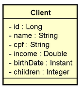

# DS-CLIENT

Este projeto é um desafio do curso DevSuperior para a criação de uma API REST utilizando as tecnologias:

- Java 11
- Spring boot
- JPA
- Spring web
- Lombook
- H2-database

---

Modelo UML da classe

---

Busca paginada de clientes:

GET

    /client

    Parâmetros:
        page={number of page}
        linesPerPage={lines per page}
        direction=ASC - default DESC
        orderBy=name - default id

Busca de cliente por id:

GET

    /clients/{id}

Inserção de novo cliente:

POST

    /clients

    Body:

    {
        "name": "Maria Silva",
        "cpf": "12345678901",
        "income": 6500.0,
        "birthDate": "1994-07-20T10:30:00Z",
        "children": 2
    }

Atualização de cliente:

PUT

    /clients/{id}

    Body:

    {
        "name": "Maria Silvaaa",
        "cpf": "12345678901",
        "income": 6500.0,
        "birthDate": "1994-07-20T10:30:00Z",
        "children": 2
    }

Deleção de cliente:

DELETE

    /clients/{id}
